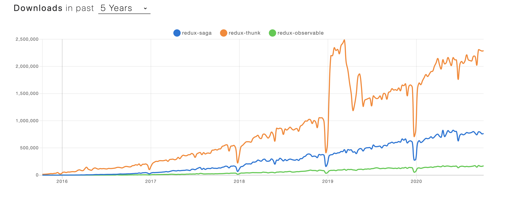
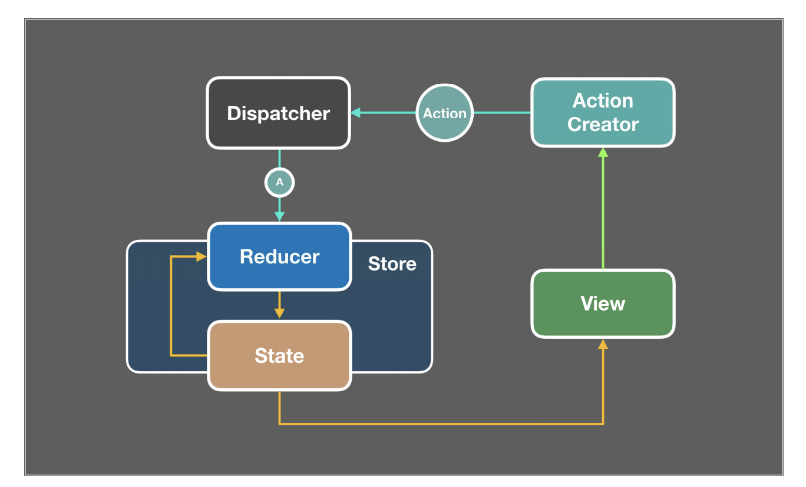
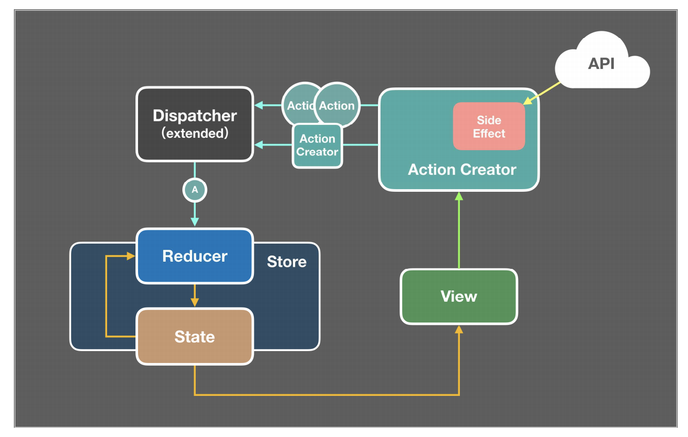

## React シリーズ

 

## - Redux-Thunk の導入 -

2020/10/20 小林

---

- なぜ、ミドルウェアを導入すべきなのかを確認する
- Redux-Thunk の特徴について確認をする

---

@snap[west span-45]

@size[0.5em] I recommend

@snapend

@snap[east span-50]

@size[0.5em](りあクト！TypeScriptで始めるつらくないReact開発)
@size[0.5em](大岡由佳)
@size[0.5em](@oukayuka)

@snapend

---

## そもそもミドルウェアって？

API 通信など副作用を伴う非同期処理を行ってくれるところ

---

## なぜミドルウェアが必要なのか？

---

## ミドルウェアを使わない場合、

- React コンポーネント内部に処理を置く

  - ライフサイクルメソッド
  - イベントハンドラで呼ばれる関数

- その結果をローカル state に格納してコンポーネント内部で使い回す

---?code=sideEffect_without_middleWare.tsx

---

このやり方だと、規模が大きくなるにつれれ様々な問題が出てくる

---

## 問題点

- コンポーネントと副作用を伴うロジックが密結合になる

  - メンテナンスコスト
  - テストしにくい
  - 再利用できないか取得したデータは使い捨てになる

- ライフサイクルメソッドを使う場合は、重複したコードを書くことになる
  - componentDidMount と componentDidUpdate

---

## そこで、ミドルウェアを使おうということになった

---

---

## Redux-Thunk のしくみ

---

## まず、Redux のしくみ

---

## Redux-Thunk のしくみ

---

---

## Hooks とは

use○○ というメソッド

---

## useState

これで state を管理できる

## useEffect

これはライフサイクルメソッドのようなもの

---

@color[#5289F7](Hooks)は何を解決してくれるの？

---

### （伝統的な）クラスコンポーネントだと、

- @size[0.5em](state を使ったロジックはコンポーネント内のあらゆる場所に散在しがち)
- @size[0.5em](小さなコンポーネントに分割することが不可能)
- @size[0.5em](可読性が低くなりがち)
- @size[0.5em](この問題を解決するため、ライフサイクルメソッドによって無理矢理分割している)

---

 

@snap[west span-45]

@snapend

@snap[east span-50]

- @size[0.5em](document.title を設定するためのロジックが componentDidMount と componentDidUpdate に分離している。)
- @size[0.5em](データ購読のためのロジックも componentDidMount と componentWillUnmount とに分離している。)
- @size[0.5em](componentDidMount には異なる種類の処理が書かれている。)

@snapend

---

では@color[#5289F7](Hooks)を使用した@color[#5289F7](関数コンポーネント)ではどうなるのか

---

@snap[west span-45]

@snapend

@snap[east span-50]

- @size[0.5em](Hooksを使うことで、ライフサイクルのメソッド名に基づくのではなく、実際に何をやっているのかに基づいてコードを分割ができるようになる。)

@snapend

---

🤔

---

クラスコンポーネントではライフサイクルメソッドで

## タイミング

を制御していたが、その保証は行ってくれるのか？

---

## 😊 大丈夫だった

---?code=useEffect_1.js

@snap[east span-50]

- @size[0.5em](第一引数に、引数なしの関数を設定（doSomething）。レンダリング時に実行される)
- @size[0.5em](戻り値を設定するとコンポーネントのアンマウント時に実行される)
- @size[0.5em](第二引数は配列で指定（省略可能）)
- @size[0.5em](そこに任意の変数を入れておくと、その値が前回のレンダリング時と変わらなければ第一引数で渡された関数の実行がキャンセルされることになる)

@snapend

---?code=useEffect_2.js

@snap[east span-50]

- @size[0.5em](第二引数は省略するとレンダリング時の毎回doSomethingは実行される)

@snapend

---?code=useEffect_3.js

@snap[east span-50]

- @size[0.5em](第二引数に空配列を渡すと、初回のレンダリング時にのみdoSomethingが実行される)

@snapend

---

## クラスコンポーネント

→ このライフサイクルのタイミングでこの処理とこの処理を実行する

## Effect Hook

→ この処理を実行したいのはこれとこれのタイミングだ

---

ご清聴、ありがとうございました！

---

@snap[west span-45]

@size[0.5em] I recommend

@snapend

@snap[east span-50]

@size[0.5em](りあクト！TypeScriptで始めるつらくないReact開発)
@size[0.5em](大岡由佳)
@size[0.5em](@oukayuka)

@snapend

---
