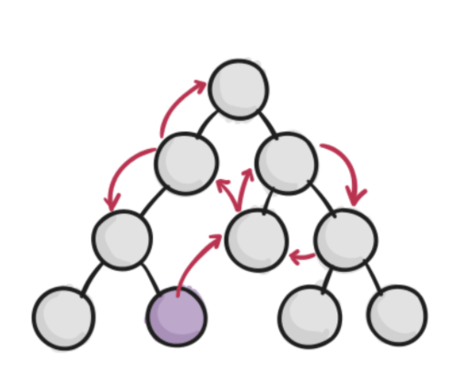

## React シリーズ -関数コンポーネントと Hooks の導入-

## 2020/7/31 小林

---

## コンポーネントと Hooks について考える

---

## なんで？

---

## 負債を産みたくない

---

## だからコンポーネントをちゃんと理解して適切な方法で実装したい

---

## コンポーネントって？

- 概念的には JavaScript の関数と似ている。props という任意の入力を受け取り、画面上に表示すべきものを記述する要素を返す。
- 独立していて再利用できる部品

---

## コンポーネントの入れ子構造で構築されている

---

## なんで？

---

## なんで？

---

## なんで？

---

## なんで？

---

## なんで？

---

## なんで？

---

## なんで？

---

## なんで？

---

## なんで？

---

## なんで？

---

## なんで？

---
