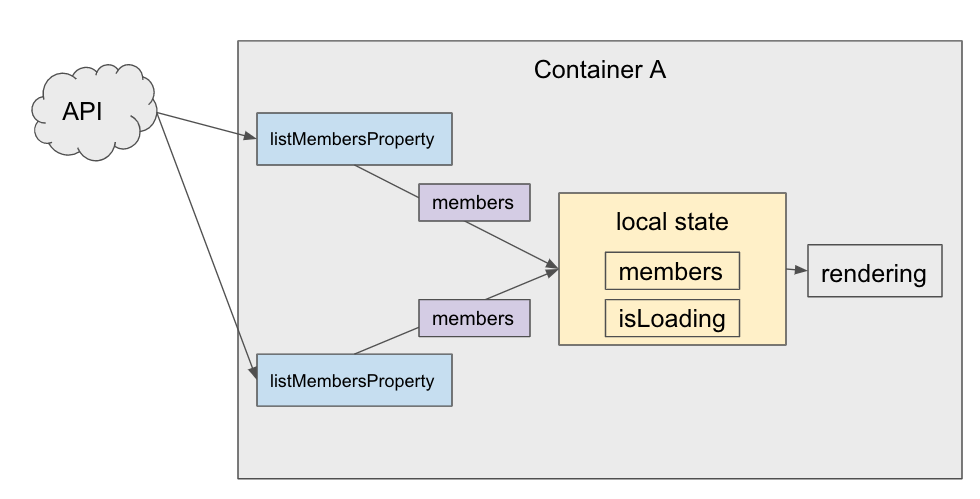
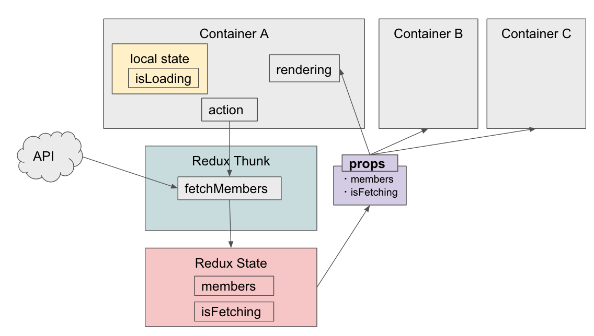
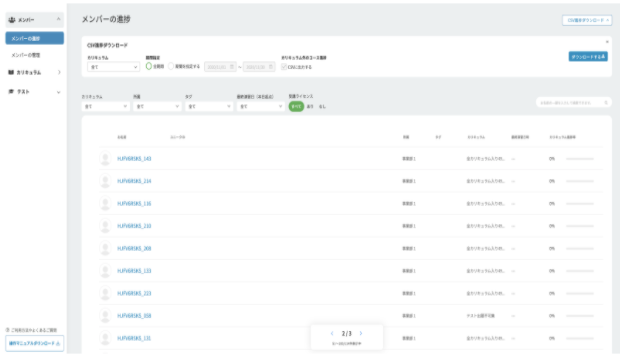
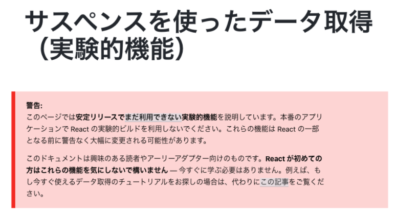
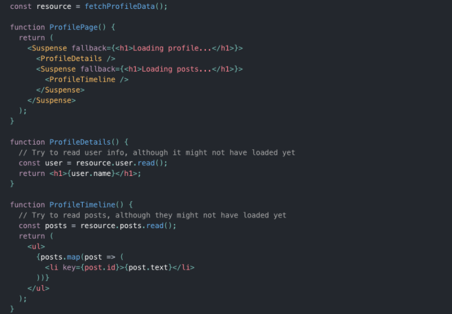
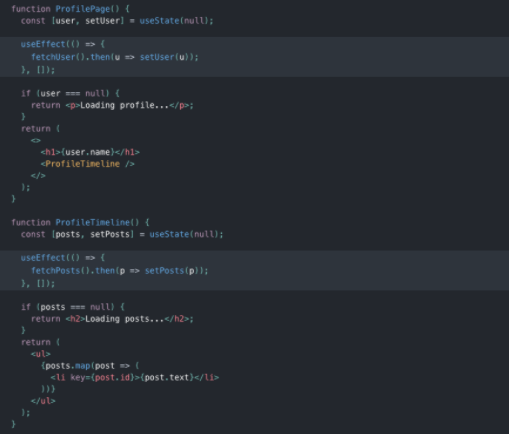
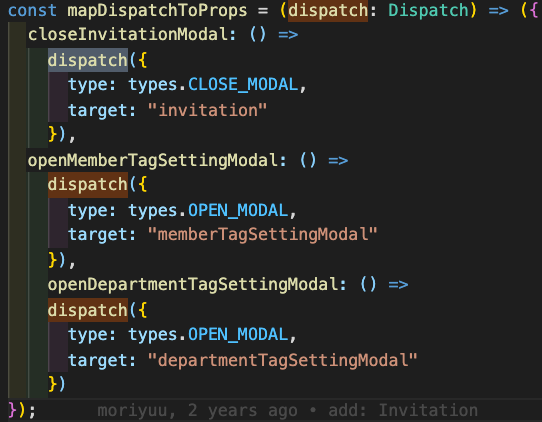
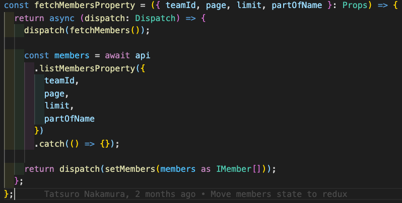
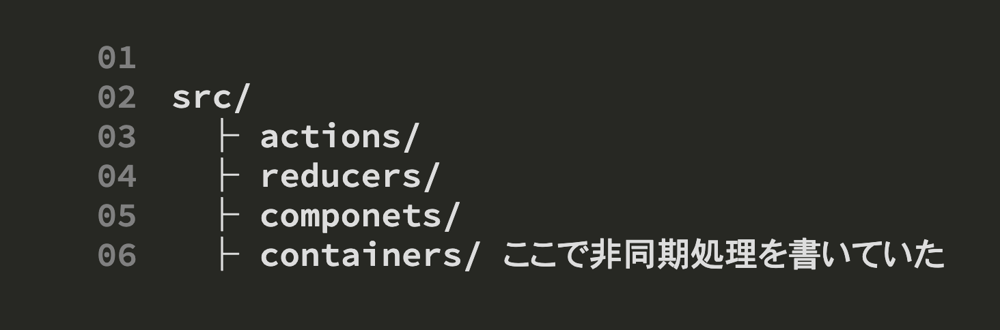
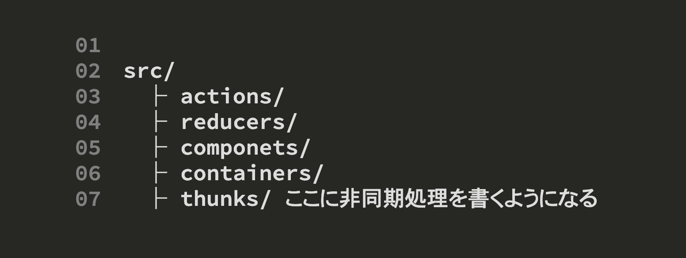

## React シリーズ

 

## - Suspense を使用したデータ取得 -

2020/12/16 小林

---

- やろうとしているリファクタリング
  - Redux 移行
- Suspense について
  - Suspense とは
  - 既存アプローチ vs Suspense

---

@snap[north]

<h4>Before</h4>
@snapend

@snap[east]

@snapend

---

@snap[north]

<h4>After</h4>
@snapend

@snap[east]

@snapend

---

<h4>@color[#5289F7](で、isFetching を実装していたら思った課題)</h4>

- isFetching と isLoading が役割的に競合している（API やその他関数の処理中か終了したかを示すフラグ）
  - 同じ役割の変数が別で存在していると混乱するの無くしたい
- true 条件下でのロジックが各 Component で似ている
  - ついでに、重複した部分はなるべく無くしたい

---

@snap[north]

<h4>@color[#5289F7](isFetching と isLoading が役割的に競合している)</h4> 
<h5>(isFetching | isLoading) ?</h5>
@snapend

@snap[west span-45]

@snapend

@snap[east span-50]

@snapend

---

## true 条件下でのロジックが各 Component で似ている

---

## なんかここらへんをスッキリさせたい 🤔

---

## あった...！

---

## しかし...

## なのでまだサービスに利用できないぽいけど紹介だけ

---

## Suspense とは

React 16.6 で、コードのロードを「待機」して宣言的にロード中状態（スピナーのようなもの）を指定することができる <Suspense> コンポーネント

---

## 宣言型とは、

ここにはこのデ ータが入るべき。後はそっちでよしなにやってくれ！』的なアプローチね。

⇆ 命令型：最終的な出力を得るために、その手順を 時系列に沿って書き下していくプログラミングのあり方

---

## データ取得用の Suspense

https://ja.reactjs.org/docs/optimizing-performance.html

---

## デモ！

---

## サスペンスは何でないのか

- データ取得の実装ではありません。

  - REST, GraphQL ではない

- データ取得をビューレイヤと密結合はさせない。
  - ロード中の状態を UI で表示するための補助とはなるが、React コンポーネントとネットワークの関係のロジックと結合させるものではない。

---

## サスペンスは何ができるのか

- ロード中状態の表示を設計することが容易になる

  - データがどのように取得されるのかについて関知しないが、アプリケーションのローディングシーケンスを細かく制御することができるようになります。

- 競合状態 (race condition) を避ける手助けになります。
  - await を使っていてすら、非同期のコードはエラーを起こしがちです。サスペンスを使うことで、データが同期的に読み出されているかのように、まるで既にロード済みであるかのように感じられます。（≒ 宣言型）

---

## 既存アプローチ vs Suspense

- 画面上にコンポーネントがレンダーされた後までデータ取得が始まらないので、このアプローチのことを “fetch-on-render” と呼ぶことにします。これは “ウォーターフォール” と呼ばれる問題を引き起こします。

- ユーザ詳細情報の取得に 3 秒かかる場合、投稿の取得の開始が 3 秒後になってしまいます！ これが「ウォーターフォール」、つまり並列化可能にもかかわらず意図せず混入してしまったシーケンスです。

---

 

@snap[west span-45 font-size]

@size[0.75em]<b>@color[#5289F7](標準の Dispatcher)</b> @size[0.5em](@container)

@size[0.5em](@color[#5289F7](純粋な action オブジェクト) のみ dispatch する)

@snapend

@snap[east span-50]

@size[0.75em]<b>@color[#5289F7](Redux Thunk)</b> @size[0.5em](@thunk)

@size[0.5em](@color[#5289F7](副作用を内包した関数や Promise オブジェクト)も dispatch する)

@snapend

---?code=thunk_example.ts

---?code=reducer.ts

---?code=actionCreator.ts

---

@snap[west span-45]

@snapend

@snap[east span-50]

@snapend

---

## まとめ

- Redux Thunk
  - 特徴 ① 純粋な action だけでなく、非同期処理を含む action creator も dispatch できるようになる
  - 特徴 ② 複数の action を dispatch することができる 
    → 使われ方：API のやりとりを Thunks に固める。action を発行するだけで API を叩けるようにする。

---

@snap[west span-45]

@size[0.5em] I recommend

@snapend

@snap[east span-50]

@size[0.5em](りあクト！TypeScriptで始めるつらくないReact開発)
@size[0.5em](大岡由佳)
@size[0.5em](@oukayuka)

## @snapend

---

ご清聴、ありがとうございました！

---
