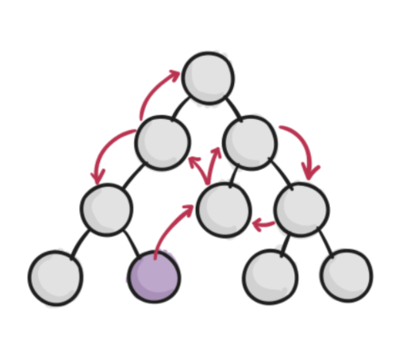

## React シリーズ

 

## -関数コンポーネントと Hooks の導入-

2020/7/31 小林

---

## コンポーネントと Hooks について考える

---

なんで？

---

## 負債を産みたくない

---

## だからコンポーネントをちゃんと理解して適切な方法で実装したい

---

## コンポーネントって？

- 概念的には JavaScript の関数と似ている。props という任意の入力を受け取り、画面上に表示すべき要素を返す。
   
- 独立していて再利用できる部品

---

## コンポーネントの入れ子構造で構築されている

---

「定義の仕方」によって分けると、

---

## クラスコンポーネント

 VS

## 関数コンポーネント

---

役割の観点で分類すると、

---

## Presentational Component

 VS

## Container Component

---

## 🏋🏻‍♀️1st Round

クラスコンポーネント VS 関数コンポーネント

---

今までは

## クラスコンポーネント

が多くのシーンで利用されてきた

---

なぜなら、クラスコンポーネントでは、

## 状態（state）

を持つことができるし、React に関する

## ライフサイクルメソッド

実装することができるから（＝高機能）

---

ここにライフサイクルメソッドの説明を簡単にいれる

---

しかし、これからは 

## 関数コンポーネント

が推奨されるようになってきてる

---

なぜなら、関数コンポーネントでも状態（state）制御することができる

## Hooks

が導入されたから （＝高機能になった）

---

## React 公式のアナウンス

<be />
- 関数コンポーネントを推奨
- ただし、段階的にで良い
- クラスコンポーネントも一生サポートしていく

[React docs フックの導入](https://ja.reactjs.org/docs/hooks-intro.html)

---

なんで関数コンポーネントを推奨しているの？

---

### 複雑なコンポーネントは理解しづらくなる

- 多くの場合、state を使ったロジックはコンポーネント内のあらゆる場所にあり、小さなコンポーネントに分割することは不可能。テストも困難。
- この問題を解決するため、関連する機能（例えばデータの購読や取得）をライフサイクルメソッドによって無理矢理分割している。

---

 

@snap[west span-45]

@snapend

@snap[east span-50]

- @size[0.5em](document.title を設定するためのロジックが componentDidMount と componentDidUpdate に分離している。)
- @size[0.5em](データ購読のためのロジックもやはり componentDidMount と componentWillUnmount とに分離している。)
- @size[0.5em](そして componentDidMount には両方の仕事のためのコードが含まれている。)

@snapend

---

では

@color[blue](Hooks)

を使用した

@color[blue](関数コンポーネント)

ではどうなるのか

---

@snap[west span-45]

@snapend

@snap[east span-50]

- @size[0.5em](Hooksを使うことで、ライフサイクルのメソッド名に基づくのではなく、実際に何をやっているのかに基づいてコードを分割ができるようになる。)

@snapend

---

🤔

---

### クラスコンポーネントではライフサイクルメソッドでタイミングを制御していたが、その保証は行ってくれるのか？

---

@snap[west span-45]

@snapend

@snap[east span-50]

@size[0.5em](コンポーネントが表示されている最中に friend プロパティが変わったらどうなるのか？) 
@size[0.5em](このコンポーネントは間違ったフレンドのオンラインステータスを表示し続けてしまいます（バグ）。) 
@size[0.5em](クラスコンポーネントの場合は、このようなケースに対処するために componentDidUpdate を加える必要がありました。)

@snapend

---

## 😊 大丈夫だった

---

- useEffect は<b>デフォルトで更新を処理</b>するため、更新のための特別なコードは不要
- 新しい副作用を適用する前に、ひとつ前の副作用をクリーンアップする

---

## なんで？

---

## なんで？

---

## なんで？

---

## なんで？

---

## なんで？

---

## なんで？

---

## なんで？
