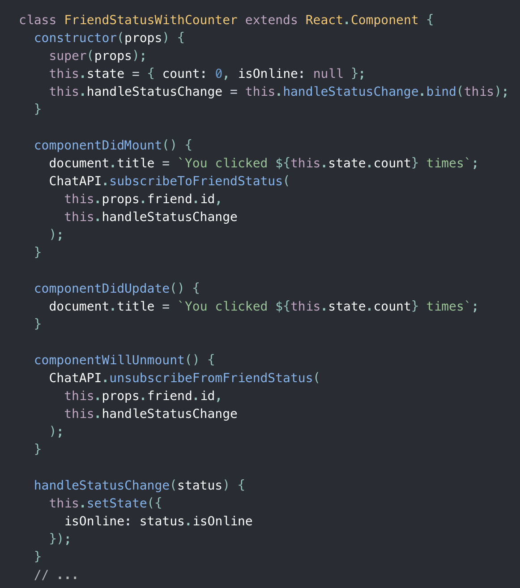
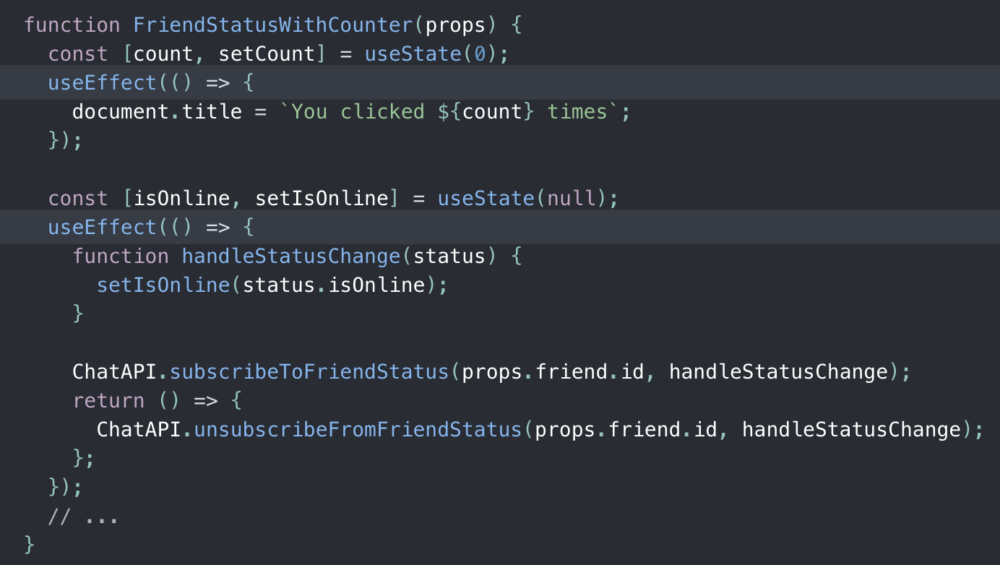
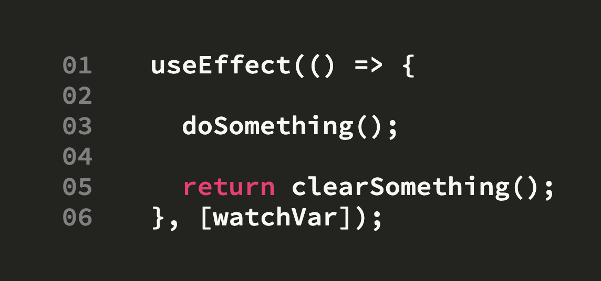
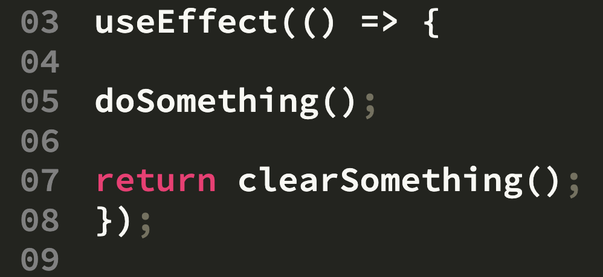
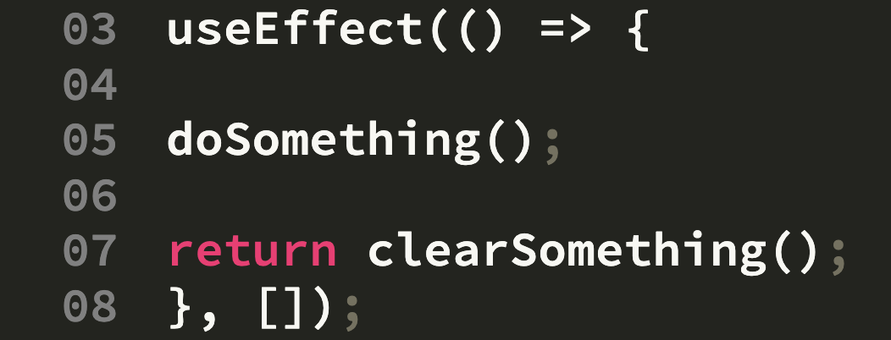

## React シリーズ

<br />

## -関数コンポーネントと Hooks の導入-

2020/7/31 小林

---

## コンポーネントと Hooks について考える

---

なんで？

---

(いつか)

## リファクタリングしたいから

---

## 特に container component の見通しがよくない

ちなみに container/Exercise.tsx は 2200 行以上ある

---

## そもそもコンポーネントって？

- 概念的には JavaScript の関数と似ている。props という任意の入力を受け取り、画面上に表示すべき要素を返す。
  <br />
- 独立していて再利用できる部品

---

コンポーネントを
<br />
「定義の仕方」によって分けると、

---

## クラスコンポーネント

<br />VS

## 関数コンポーネント

---

役割の観点で分類すると、

---

## Presentational Component (見た目)

<br />VS

## Container Component (ロジック)

---

🏋🏻‍♀️1st Round

<br />

## クラスコンポーネント

<br />VS

## 関数コンポーネント

---

今までは

## クラスコンポーネント

が多くのシーンで利用されてきた

---

なぜなら、クラスコンポーネントでは、

## 状態（state）

を持つことができるし、React に関する

## ライフサイクルメソッド

実装することができるから（＝高機能）

---

ここにライフサイクルメソッドの説明を簡単にいれる

---

しかし、これからは<br />

## 関数コンポーネント

が推奨されるようになってきてる

---

なぜなら、関数コンポーネントでも状態（state）制御することができる

## Hooks

が導入されたから（＝高機能になった）

<br />
<li>React Conf 2018 基調講演での Hooks の発表と α 版リリース</li>
<li>2019 年 3 月にリリースされた React 16.8 で正式に盛り込まれた</li>

---

## React 公式も、

<be />
- 関数コンポーネントを推奨
- ただし、段階的にで良い
- クラスコンポーネントも一生サポートしていく

(https://ja.reactjs.org/docs/hooks-intro.html)

---

## Hooks とは

use○○ というメソッド

---

## userState

これで state を管理できる

## useEffect

これはライフサイクルメソッドのようなもの

---

@color[#5289F7](Hooks)は何を解決してくれるの？

---

### （伝統的な）クラスコンポーネントだと、

- @size[0.5em](state を使ったロジックはコンポーネント内のあらゆる場所に散在しがち)
- @size[0.5em](小さなコンポーネントに分割することが不可能)
- @size[0.5em](可読性が低くなりがち)
- @size[0.5em](この問題を解決するため、ライフサイクルメソッドによって無理矢理分割している)

---

<br>

@snap[west span-45]



@snapend

@snap[east span-50]

- @size[0.5em](document.title を設定するためのロジックが componentDidMount と componentDidUpdate に分離している。)
- @size[0.5em](データ購読のためのロジックも componentDidMount と componentWillUnmount とに分離している。)
- @size[0.5em](componentDidMount には異なる種類の処理が書かれている。)

@snapend

---

では

@color[#5289F7](Hooks)

を使用した

@color[#5289F7](関数コンポーネント)

ではどうなるのか

---

@snap[west span-45]



@snapend

@snap[east span-50]

- @size[0.5em](Hooksを使うことで、ライフサイクルのメソッド名に基づくのではなく、実際に何をやっているのかに基づいてコードを分割ができるようになる。)

@snapend

---

🤔

---

クラスコンポーネントではライフサイクルメソッドで

## タイミング

を制御していたが、その保証は行ってくれるのか？

---

## 😊 大丈夫だった

---

@snap[west span-45]



@snapend

@snap[east span-50]

- @size[0.5em](第一引数に、引数なしの関数を設定（doSomething）。レンダリング時に実行される)
- @size[0.5em](戻り値を設定するとコンポーネントのアンマウント時に実行される)
- @size[0.5em](第二引数は配列で指定（省略可能）)
- @size[0.5em](そこに任意の変数を入れておくと、その値が前回のレンダリング時と変わらなければ第一引数で渡された関数の実行がキャンセルされることになる)

@snapend

---

@snap[west span-45]



@snapend

@snap[east span-50]

- @size[0.5em](第二引数は省略するとレンダリング時の毎回doSomethingは実行される)
- @size[0.5em](そこに任意の変数を入れておくと、その値が前回のレンダリング時と変わらなければ第一引数で渡された関数の実行がキャンセルされることになる)

@snapend

---

@snap[west span-45]



@snapend

@snap[east span-50]

- @size[0.5em](第二引数にから配列を渡す、初回のレンダリング時にのみdoSomethingが実行される)
- @size[0.5em](そこに任意の変数を入れておくと、その値が前回のレンダリング時と変わらなければ第一引数で渡された関数の実行がキャンセルされることになる)

@snapend

---

## クラスコンポーネント

このライフサイクルのタイミングでこの処理とこの処理を実行する

## Effect Hook

この処理を実行したいのはこれとこれのライフサイクルのタイミングだ

---

    @snap[north-east span-100 text-06 text-gray]
    Live Code Presenting
    @snapend

    ```

    useEffect(() => {

    doSomething();

    return clearSomething();
    });

    ```

```

```
