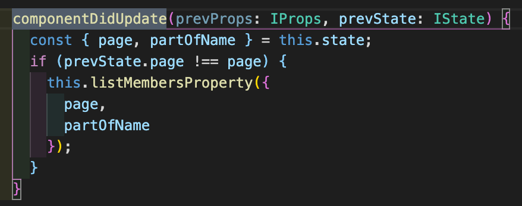

## React シリーズ

 

## -関数コンポーネントと Hooks の導入-

2020/7/31 小林

---

## コンポーネントと Hooks について考える

---

なんで？

---

(いつか)

## リファクタリングしたいから

---

## 特に container component の見通しがよくない

ちなみに container/Exercise.tsx は 2200 行以上ある

---

## そもそもコンポーネントって？

- 概念的には JavaScript の関数と似ている。props という任意の入力を受け取り、画面上に表示すべき要素を返す。
   
- 独立していて再利用できる部品

---

コンポーネントを
 
「定義の仕方」によって分けると、

---

## クラスコンポーネント

 VS

## 関数コンポーネント

---

役割の観点で分類すると、

---

## Presentational Component (見た目)

 VS

## Container Component (ロジック)

---

🏋🏻‍♀️1st Round

 

## クラスコンポーネント

 VS

## 関数コンポーネント

---

今までは

## クラスコンポーネント

が多くのシーンで利用されてきた

---

なぜなら、クラスコンポーネントでは、

## 状態（state）

を持つことができるし、React に関する

## ライフサイクルメソッド

実装することができるから（＝高機能）

---

ここにライフサイクルメソッドの説明を簡単にいれる

---

しかし、これからは 

## 関数コンポーネント

が推奨されるようになってきてる

---

なぜなら、関数コンポーネントでも状態（state）制御することができる

## Hooks

が導入されたから（＝高機能になった）

 
<li>React Conf 2018 基調講演での Hooks の発表と α 版リリース</li>
<li>2019 年 3 月にリリースされた React 16.8 で正式に盛り込まれた</li>

---

## React 公式も、

<be />
- 関数コンポーネントを推奨
- ただし、段階的にで良い
- クラスコンポーネントも一生サポートしていく

(https://ja.reactjs.org/docs/hooks-intro.html)

---

## Hooks とは

use○○ というメソッド

- userState
- useEffect

---

@color[#5289F7](Hooks)は何を解決してくれるの？

---

### （伝統的な）クラスコンポーネントだと、

- @size[0.5em](state を使ったロジックはコンポーネント内のあらゆる場所に散在しがち)
- @size[0.5em](小さなコンポーネントに分割することが不可能)
- @size[0.5em](可読性が低くなりがち)
- @size[0.5em](この問題を解決するため、ライフサイクルメソッドによって無理矢理分割している)

---

 

@snap[west span-45]

@snapend

@snap[east span-50]

- @size[0.5em](document.title を設定するためのロジックが componentDidMount と componentDidUpdate に分離している。)
- @size[0.5em](データ購読のためのロジックも componentDidMount と componentWillUnmount とに分離している。)
- @size[0.5em](componentDidMount には異なる種類の処理が書かれている。)

@snapend

---

では

@color[#5289F7](Hooks)

を使用した

@color[#5289F7](関数コンポーネント)

ではどうなるのか

---

@snap[west span-45]

@snapend

@snap[east span-50]

- @size[0.5em](Hooksを使うことで、ライフサイクルのメソッド名に基づくのではなく、実際に何をやっているのかに基づいてコードを分割ができるようになる。)

@snapend

---

🤔

---

クラスコンポーネントではライフサイクルメソッドで

## タイミング

を制御していたが、その保証は行ってくれるのか？

---

このページいらない？

@snap[west span-45]

@snapend

@snap[east span-50]

@size[0.5em](コンポーネントが表示されている最中に friend プロパティが変わったらどうなるのか？) 
@size[0.5em](このコンポーネントは間違ったフレンドのオンラインステータスを表示し続けてしまいます（バグ）。) 
@size[0.5em](クラスコンポーネントの場合は、このようなケースに対処するために componentDidUpdate を加える必要がありました。)

@snapend

---

    @snap[north-east span-100 text-06 text-gray]
    useEffectを使ってみる
    @snapend

      useEffect(() => {

        doSomething();

        return clearSomething();
      }, [watchVar]);

    @[2-7]

---

## 😊 大丈夫だった

---

- useEffect は<b>デフォルトで更新を処理</b>するため、更新のための特別なコードは不要
- 新しい副作用を適用する前に、ひとつ前の副作用をクリーンアップする

---

あと、ライフサイクルメソッドで前々から思っていた 🤔 な仕様がある

---

@snap[west span-45]


@snapend@

@snap[east span-50]
@size[0.5em](ComponentDidUpdate なのに、毎回自分で、現在の state を props から渡される値の比較をして、それらが異な場合のみ処理を行うという保証を必ず行わなければいけない)
@snapend

---

だが、Hooks を使えば

---

これでいける

@snap[east span-50]

@snapend

@snap[east span-50]
@size[0.5em](上記の例では、第 2 引数として [count] を渡しています。どういう意味でしょうか？ もし count が 5 で、次回のコンポーネントのレンダー時にも count がまだ 5 であった場合、React は前回のレンダー時に覚えておいた [5] と今回のレンダーの [5] とを比較します。配列内のすべての要素が同一 (5 === 5) ですので、React は副作用をスキップします。これが最適化です。
再レンダー時に count が 6 に変更されている場合、前回レンダー時に覚えておいた [5] と今回のレンダー時の [6] という配列とを比較します。今回は 5 !== 6 ですので React は副作用を再適用します。配列内に複数の要素がある場合、React は配列内の要素のうちひとつでも変わっている場合に副作用を再実行します。
)
@snapend

---

## なんで？

---

## なんで？

---

## なんで？
